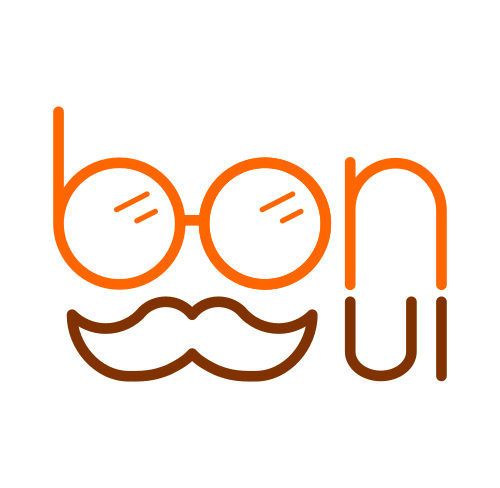
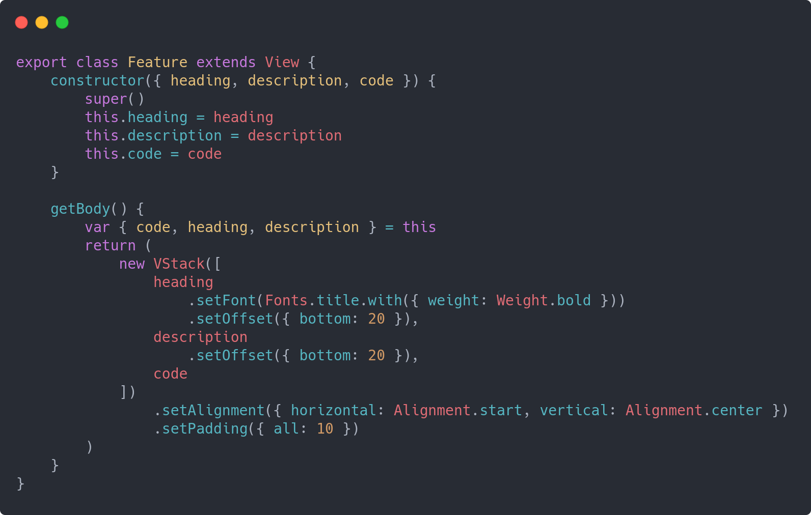
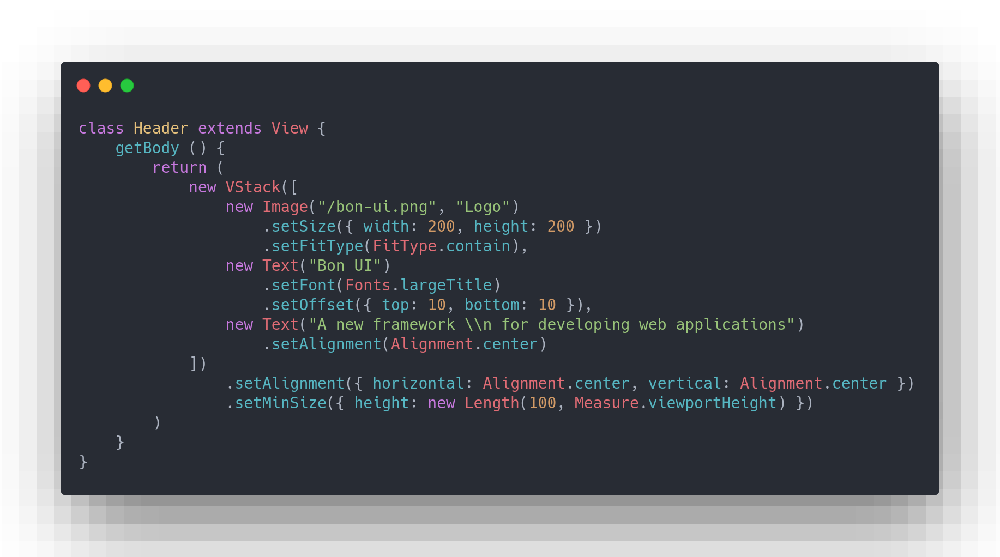
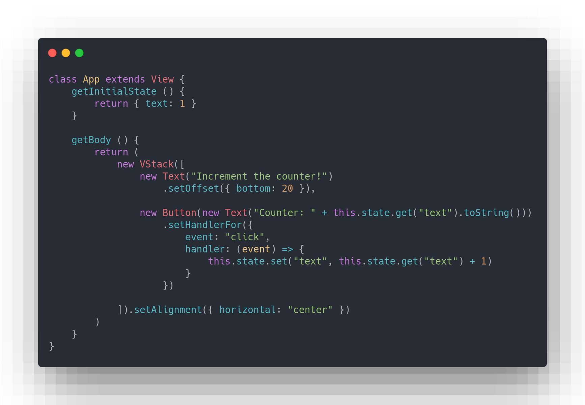

# Bon UI
A framework with declarative syntax for developing UI for web apps

## :heavy_check_mark: Features
### Component-based
You can build your own reusable components or use built-in.

### Declarative syntax
With Bon UI it is very easy to create dynamic and interactive user interfaces. Declarative syntax helps you to navigate in code and to easily understand what it does.

### States system
Each component has it's own state. When you update the state, the reconciler will automaticly update the DOM.

## :exclamation:Important notes
- Documentation will be written a bit later
- This is the alpha version of framework
- Please, contact us if you wish us to add something to the framework or found a bug
