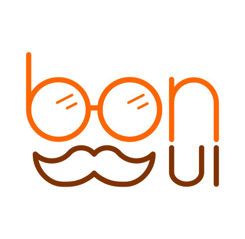

<h1 align="center">
    Bon UI
</h1>

<div align="center">
    
</div>

<div align="center">
    <strong>A framework with declarative syntax for developing UI for web apps</strong>
</div>

<div align="center">
    <!-- Current version on NPM -->
    <a href="https://npmjs.org/package/@teplovs/bon-ui">
        
    </a>
    <!-- Bundle size -->
    <a href="https://npmjs.org/package/@teplovs/bon-ui">
        
    </a>
    <!-- Downloads -->
    <a href="https://npmjs.org/package/@teplovs/bon-ui">
        
    </a>
</div>

## :heavy_check_mark: Features
### Component-based
You can build your own reusable components or use built-in.
```javascript
class Feature extends View {
    body() {
        return (
            new VStack([
                new Text(this.options.title)
                    .font(Fonts.title.with({ weight: Weight.bold }))
                    .offset({ bottom: 20 }),

                this.options.description
                    .offset({ bottom: 20 })
            ])
                .padding({ all: 10 })
        )
    }
}
```

### Declarative syntax
With Bon UI it is very easy to create dynamic and interactive user interfaces. Declarative syntax helps you to navigate in code and to easily understand what it does.
```javascript
class Header extends View {
    body () {
        return (
            new VStack([
                new Image("./Images/bon-ui.png", "Logo")
                    .size({ width: 200, height: 200 })
                    .fitType(FitType.contain),
                new Text("Bon UI")
                    .font(Fonts.largeTitle)
                    .offset({ top: 10, bottom: 10 })
                    .foreground({ color: Colors.orange }),
                new Text("A new framework\nfor developing web applications")
                    .alignment(Alignment.center)
            ])
                .alignment({ horizontal: Alignment.center, vertical: Alignment.center })
                .minSize({ height: viewportHeight(100) })
        )
    }
}
```

### States system
Each component has it's own state. When you update the state, the reconciler will automaticly update the DOM.
```javascript
class AppView extends View {
    initialState() {
        return { counter: 1 }
    }

    body() {
        return (
            new VStack([
                new Text("Increment the counter by clicking the button!")
                    .offset({ bottom: 20 }),
                
                new Button(new Text("Counter: " + this.state.get("counter").toString()))
                    .handle("click", event => {
                        this.state.set({
                            counter: this.state.get("counter") + 1
                        })
                    })
            ])
        )
    }
}
```

## Documentation
You can find the API documentation by visiting [this](https://teplovs.github.io/bon-ui-docs) website.

## :exclamation:Important notes
- This is the alpha version of framework
- Please, contact us if you wish us to add something to the framework or found a bug

